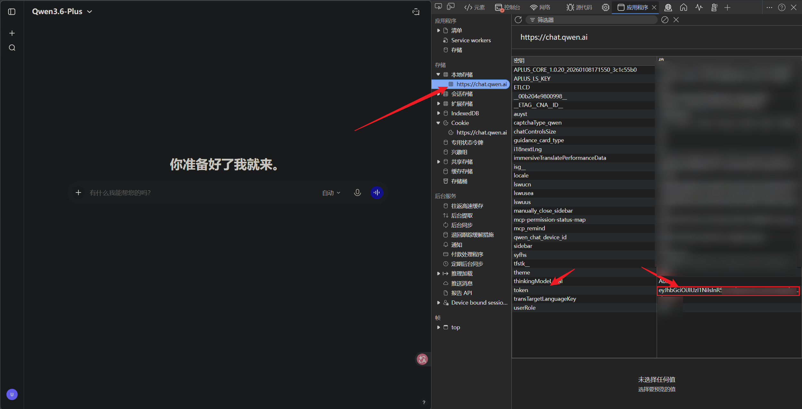
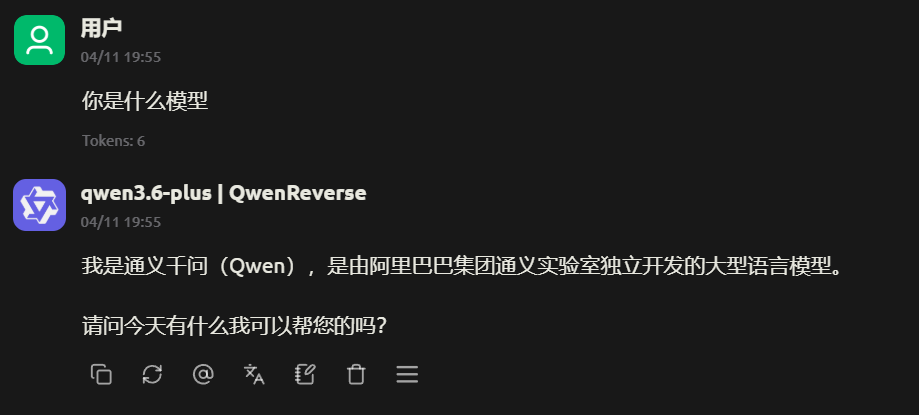
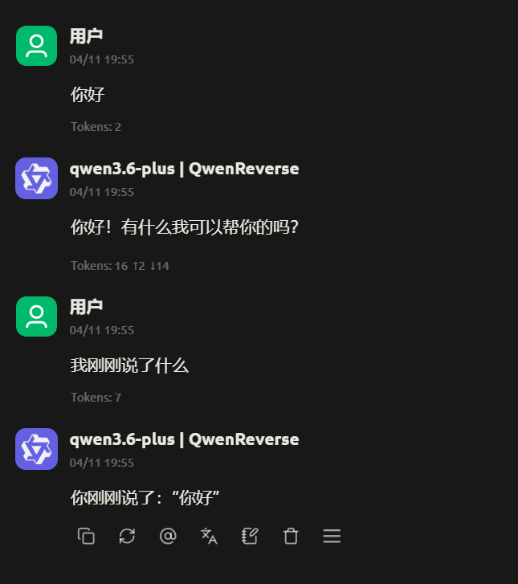
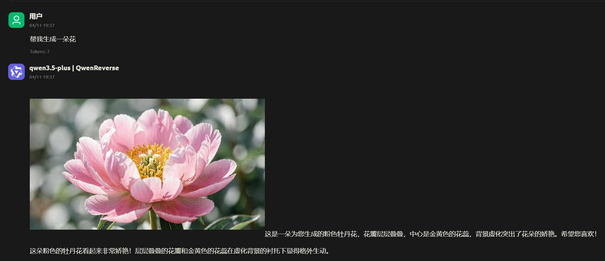

# Qwen AI OpenAI Compatible API

[](https://www.python.org/downloads/)
[](https://fastapi.tiangolo.com/)
[](https://opensource.org/licenses/MIT)

基于 Qwen AI (chat.qwen.ai) 的逆向 API，提供 OpenAI 兼容接口。

## ✨ 功能特性

- 🔌 **OpenAI 兼容** - 与 OpenAI SDK 完全兼容的接口
- 🚀 **流式响应** - 实时流式输出，低延迟
- 💬 **上下文支持** - 多轮对话，保持对话连贯性
- 🧠 **思考过程** - 展示模型的推理思考过程
- 🎨 **图片生成** - 支持 Qwen 的图片生成功能
- 🔄 **Token 轮询** - 多 Token 随机负载均衡
- ✅ **健康检查** - Token 可用性检测接口
- 🌐 **Vless 代理池** - 支持从订阅 URL 获取和管理 Vless 节点
- 📍 **节点筛选** - 按规则筛选节点（如 CF优选-电信）
- 🔍 **健康检测** - 自动测试节点可用性和延迟
- 📊 **代理管理** - 完整的代理池管理 API

## 📦 安装

### 环境要求
- Python 3.8+

### 安装依赖

```bash
pip install -r requirements.txt
```

## 🚀 快速开始

### 1. 快速配置

#### 1.1 获取 JWT Token


1. 访问 https://chat.qwen.ai 并登录账号
2. 按 F12 打开浏览器开发者工具
3. 进入 **Application** → **Local Storage** → **https://chat.qwen.ai**
4. 复制 `token` 键的值

#### 1.2 创建 .env 文件

```bash
# 复制示例配置文件
cp .env.example .env

# 编辑 .env 文件，填写你的配置
```

### 2. 启动服务

```bash
python server.py
```

### 3. 测试 API

```bash
curl -X POST http://localhost:8000/v1/chat/completions \
  -H "Authorization: Bearer <YOUR_JWT_TOKEN>" \
  -H "Content-Type: application/json" \
  -d '{
    "model": "qwen3.5-plus",
    "messages": [{"role": "user", "content": "Hello"}]
  }'
```

## 🎬 DEMO 演示

### 验明正身


### 多轮对话


### 画图功能


## 📖 API 文档

### 对话补全

```http
POST /v1/chat/completions
```

**请求头**
| 参数 | 说明 |
|------|------|
| Authorization | Bearer Token，支持单 Token 或多 Token（逗号分隔） |
| Content-Type | application/json |

**请求体**
```json
{
  "model": "qwen3.5-plus",
  "messages": [
    {"role": "user", "content": "Hello"}
  ],
  "stream": false,
  "temperature": 0.7
}
```

**参数说明**
| 参数 | 类型 | 必填 | 说明 |
|------|------|------|------|
| model | string | 是 | 模型名称，如 qwen3.5-plus |
| messages | array | 是 | 消息列表 |
| stream | boolean | 否 | 是否流式输出，默认 false |
| temperature | float | 否 | 温度参数，默认 null |

### 自动删除对话

设置 `AUTO_DELETE_CHAT=true` 环境变量后，每次对话完成时会自动删除网页对话记录，保持账户清洁。

```bash
# .env 文件配置
AUTO_DELETE_CHAT=true
```

### 管理后台

访问 `http://localhost:8000/admin` 打开管理后台，可以：
- 查看系统状态和统计信息
- 管理代理节点（刷新订阅、测试节点）
- 查看可用模型列表
- 查看系统日志
- 修改系统设置

### Token 健康检查

```http
POST /v1/tokens/health
GET /v1/tokens/health?tokens=token1,token2
```

**请求体**
```json
{
  "tokens": "jwt_token_1,jwt_token_2"
}
```

**响应**
```json
{
  "total": 2,
  "healthy": 1,
  "unhealthy": 1,
  "results": [
    {
      "token": "eyJhbGci...",
      "status": "healthy",
      "valid": true
    },
    {
      "token": "invalid...",
      "status": "unhealthy",
      "valid": false,
      "error": "Token expired"
    }
  ]
}
```

### 获取模型列表

```http
GET /v1/models
```

## 💻 使用示例

### Python

```python
import requests

url = "http://localhost:8080/v1/chat/completions"
headers = {"Authorization": "Bearer YOUR_JWT_TOKEN"}

data = {
    "model": "qwen3.5-plus",
    "messages": [{"role": "user", "content": "Hello"}]
}

response = requests.post(url, headers=headers, json=data)
print(response.json())
```

### 流式响应

```python
import requests

url = "http://localhost:8080/v1/chat/completions"
headers = {"Authorization": "Bearer YOUR_JWT_TOKEN"}

data = {
    "model": "qwen3.5-plus",
    "messages": [{"role": "user", "content": "Hello"}],
    "stream": True
}

response = requests.post(url, headers=headers, json=data, stream=True)
for line in response.iter_lines():
    if line:
        print(line.decode('utf-8'))
```

### 上下文对话

```python
messages = [
    {"role": "user", "content": "My name is Alice"},
    {"role": "assistant", "content": "Hello Alice!"},
    {"role": "user", "content": "What is my name?"}
]

data = {
    "model": "qwen3.5-plus",
    "messages": messages
}

# 模型会回答 "Your name is Alice"
```

### 多 Token 轮询

```python
# 使用多个 Token，自动随机选择
tokens = "token1,token2,token3"
headers = {"Authorization": f"Bearer {tokens}"}
```

### OpenAI SDK

```python
from openai import OpenAI

client = OpenAI(
    base_url="http://localhost:8080/v1",
    api_key="YOUR_JWT_TOKEN"
)

response = client.chat.completions.create(
    model="qwen3.5-plus",
    messages=[{"role": "user", "content": "Hello"}]
)

print(response.choices[0].message.content)
```

## 🔧 配置选项

### 启动参数

```bash
python start_server.py --host 0.0.0.0 --port 8080
```

| 参数 | 默认值 | 说明 |
|------|--------|------|
| --host | 0.0.0.0 | 监听地址 |
| --port | 8000 | 监听端口 |
| --reload | False | 开发模式自动重载 |

### 代理配置

本项目支持 Vless 协议代理池，可用于 IP 轮换和访问优化。

#### 方式一：环境变量配置

```bash
# 设置 Vless 代理（支持多个，用逗号、分号或换行分隔）
export VLESS_PROXIES="vless://uuid@host1:443?security=tls...,vless://uuid@host2:443?security=tls..."

# 或指定代理配置文件
export VLESS_PROXY_FILE="/path/to/proxy_config.txt"

# 同时支持普通 HTTP/HTTPS 代理
export HTTP_PROXY="http://proxy.example.com:8080"
export HTTPS_PROXY="http://proxy.example.com:8080"
```

#### 方式二：配置文件

创建 `proxy_config.txt` 文件（参考 `proxy_config.example.txt`）：

```
# 每行一个 Vless URI
vless://12345678-1234-1234-1234-123456789abc@example.com:443?security=tls&type=tcp&sni=example.com#Proxy1
vless://87654321-4321-4321-4321-cba987654321@example2.com:443?security=tls&type=ws&path=/ws#Proxy2
```

然后设置环境变量：

```bash
export VLESS_PROXY_FILE="proxy_config.txt"
```

#### Vless URI 格式

```
vless://{uuid}@{address}:{port}?{parameters}#{remark}
```

**参数说明：**

| 参数 | 说明 | 示例 |
|------|------|------|
| uuid | 用户 ID | 12345678-1234-1234-1234-123456789abc |
| address | 服务器地址 | example.com |
| port | 服务器端口 | 443 |
| security | 安全类型 | tls, reality, none |
| type | 传输类型 | tcp, ws, grpc |
| host | 主机名 | example.com |
| path | WebSocket 路径 | /ws |
| sni | TLS SNI | example.com |
| fp | 指纹 | chrome, firefox, safari |
| pbk | Reality 公钥 | PublicKey |
| sid | Reality ShortID | ShortID |

#### 代理池特性

- **自动轮换**：支持轮询和随机两种策略
- **健康检查**：自动检测代理可用性
- **故障转移**：自动切换到健康代理
- **多协议支持**：同时支持 Vless 和普通 HTTP 代理

### 订阅代理配置（可选）

支持从订阅URL自动获取和筛选 Vless 节点。

#### 配置方法

创建 `.env` 文件：

```bash
# 启用代理功能
PROXY_ENABLED=true

# 订阅URL（多个用逗号分隔）
VLESS_SUBSCRIPTION_URLS=https://example.com/subscription

# 节点匹配规则（如 CF优选-电信）
VLESS_SUBSCRIPTION_PATTERNS=CF优选-电信

# 启动时自动刷新
VLESS_AUTO_REFRESH_ON_START=true
```

#### 启动服务

```bash
# 正常启动（代理会根据配置自动启用/禁用）
python start_server.py
```

#### 代理管理 API

| 端点 | 方法 | 说明 |
|------|------|------|
| `/v1/proxy/stats` | GET | 获取代理统计 |
| `/v1/proxy/nodes` | GET | 获取节点列表 |
| `/v1/proxy/refresh` | POST | 刷新订阅 |
| `/v1/proxy/test` | POST | 测试节点 |

详细配置说明请参考 [PROXY_SETUP.md](PROXY_SETUP.md)

## 🌐 代理功能详解

### 订阅管理

- **自动获取**：从订阅 URL 自动获取 Vless 节点
- **规则筛选**：按节点名称规则筛选（如 `CF优选-电信`）
- **本地存储**：将节点存储到本地文件，持久化管理

### 节点测试

- **并发测试**：同时测试多个节点的可用性
- **延迟测量**：测试节点响应时间
- **健康标记**：自动标记可用/不可用节点

### 代理管理 API

| 端点 | 方法 | 说明 |
|------|------|------|
| `/v1/proxy/stats` | GET | 获取代理池统计信息 |
| `/v1/proxy/nodes` | GET | 获取节点列表 |
| `/v1/proxy/refresh` | POST | 刷新订阅并测试节点 |
| `/v1/proxy/test` | POST | 测试指定节点 |

### 使用示例

**刷新订阅**：
```bash
curl -X POST http://localhost:8000/v1/proxy/refresh \
  -H "Content-Type: application/json" \
  -d '{"test_nodes": true}'
```

**查看统计**：
```bash
curl http://localhost:8000/v1/proxy/stats
```

**获取节点**：
```bash
curl http://localhost:8000/v1/proxy/nodes
```

## 🎯 支持模型

| 模型 | 描述 |
|------|------|
| qwen3.6-plus | 最新旗舰模型 |
| qwen3.5-plus | 高性能模型 |
| qwen3.5-flash | 快速响应模型 |
| qwen3.5-max-2026-03-08 | 最大上下文模型（预览版） |
| qwen3-max | 最大参数模型 |
| qwen3-coder | 代码生成模型 |
| qwen2.5-max | 稳定版本模型 |

## 📁 项目结构

```
qwen-ai-reverse-api/
├── qwen_ai/              # Python SDK
│   ├── __init__.py
│   ├── adapter.py         # API 适配器
│   ├── client.py          # OpenAI 兼容客户端
│   ├── stream_handler.py  # 流处理
│   ├── tool_parser.py     # 工具解析
│   ├── vless_proxy.py     # Vless 代理池
│   ├── subscription.py    # 订阅管理
│   ├── node_storage.py    # 节点存储
│   └── node_tester.py     # 节点测试
├── server.py              # FastAPI 服务
├── start_server.py        # 启动脚本
├── requirements.txt       # 依赖
├── .env.example           # 环境变量示例
├── proxy_config.example.txt # 代理配置示例
├── PROXY_SETUP.md         # 代理配置文档
├── templates/             # HTML 模板
│   └── admin.html         # 管理后台页面
└── README.md              # 文档
```

## ⚠️ 免责声明

本项目是对 Qwen AI 网页版 API 的逆向工程，仅供学习研究使用。请遵守 Qwen AI 的服务条款，不要用于商业用途或大规模请求。

## 📄 License

[MIT License](LICENSE)
